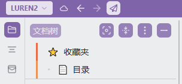
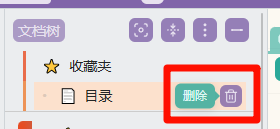

# REAMDE-mini-favorites

# 🔍 核心功能

本插件为思源笔记带来类似Notion的收藏夹管理体验，通过蓝色图标（V代表"Valuable-有价值的"）快速访问以下功能：

- **一键收藏**：任意笔记/文档/页面的星标收藏
- **聚合视图**：跨笔记本的收藏内容统一展示（实现自定义目录功能）
- **快速定位**：点击可以直接打开页面

# 🛠️ 安装指南

1. 方式一：（推荐）打开 Siyuan 集市，直接通过集市下载。
2. 方式二：下载 `package.zip`​ 格式的包，解压后放到  `\data\plugins`​ 文件夹中。

# 添加收藏

> 在文档树中，右键或通过“更多”按钮，找到 “插件->添加到收藏夹”，点击后，可以将页面收藏到收藏夹中。

> 下面是添加后的效果，会在文档树下方出现一个页面收藏

# 移除收藏页面

对于收藏的页面，悬浮时会出现删除按钮，点击后会直接从收藏夹移除，如果收藏夹没有任何收藏内容，收藏夹本身也会移除。

‍

# 更新日志

###### 1.0.0+20250615

- 完成给文档树对页面文档增加“添加到收藏”、收藏夹区域、从收藏夹删除功能
- 完成在收藏夹区域直接打开页面功能
- 当创建文档、删除文档、重命名文档、修改文档图标、移动文档时，收藏夹区域对应文档同步变化
- 适配流行主题：Savor、Asri、Dark+、Tsundoku、Rem Craft、mini-vlook

‍

‍
